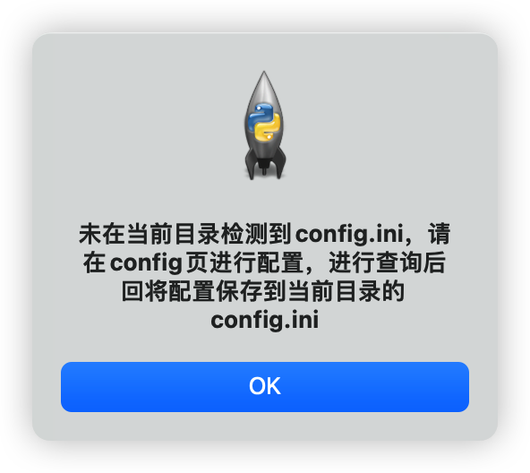
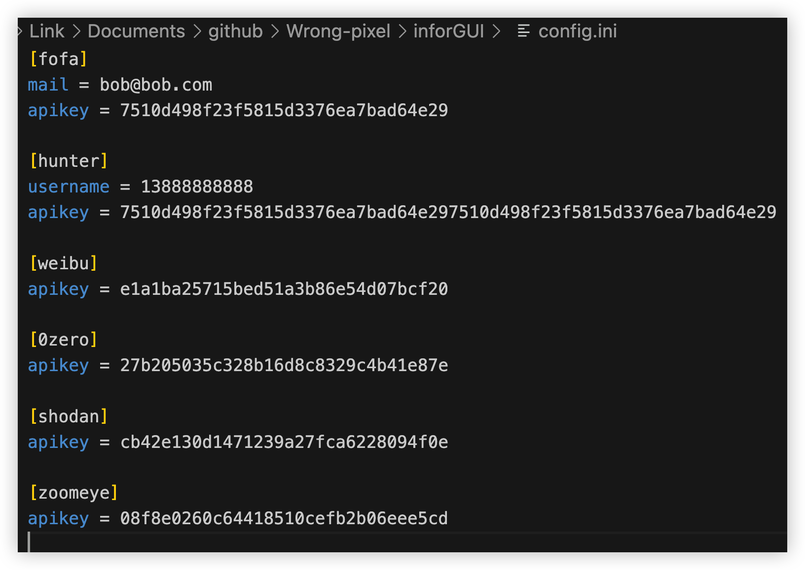

# inforGUI

python3+tkinter+ttk完成的项目

 

# 开始使用

### 1、首次使用会提示未发现config.ini，需要在配置页进行配置后才能进行正常查询，并将配置自动保存到当前目录的`config.ini`文件下

 

### 2、在config页配置各平台的apikey及其他信息

 

### 3、进行一次查询操作后会将配置文件保存到当前目录的config.ini

 

### 4、之后进行查询会自动读取config.ini的内容并放到配置页中，需要修改在配置页中进行修改即可

