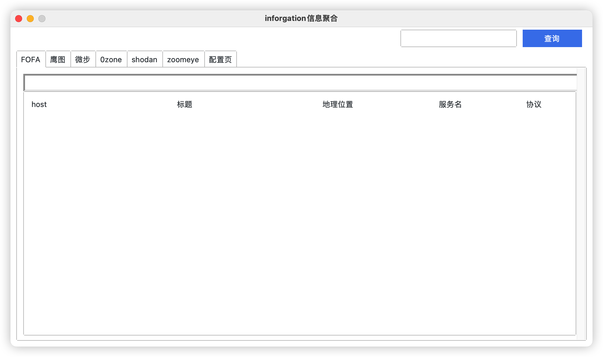
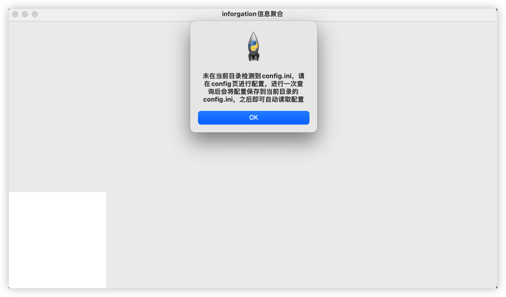
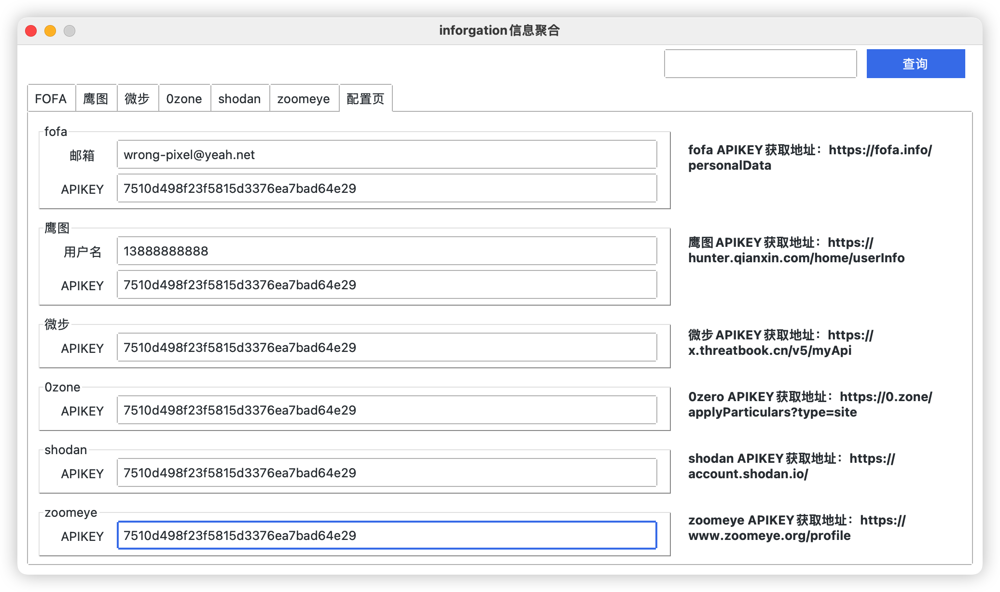
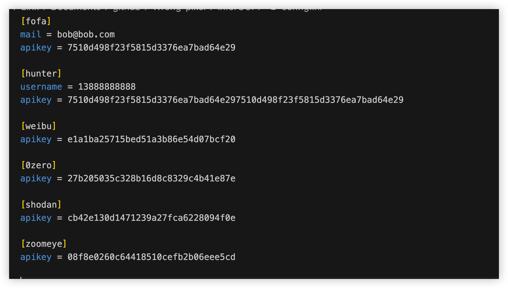
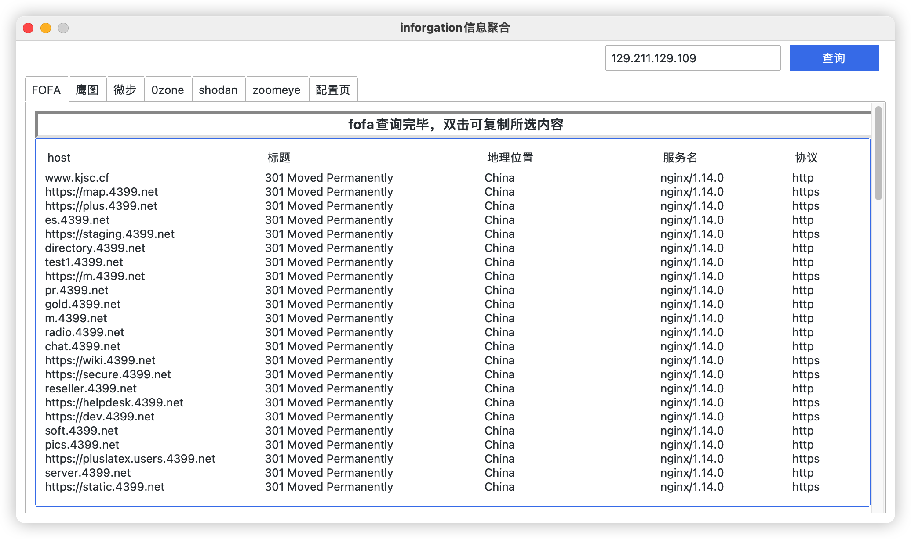
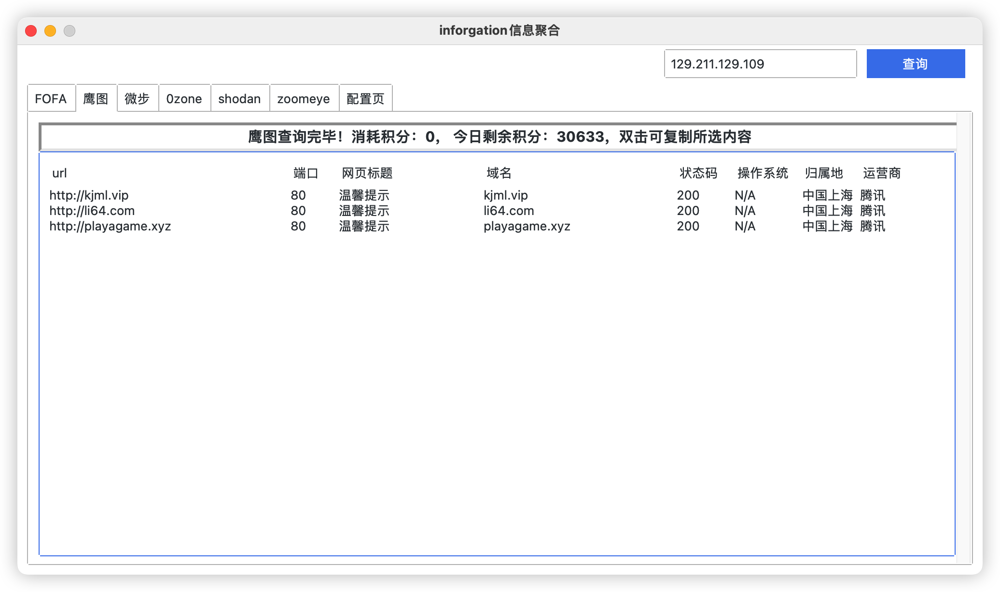
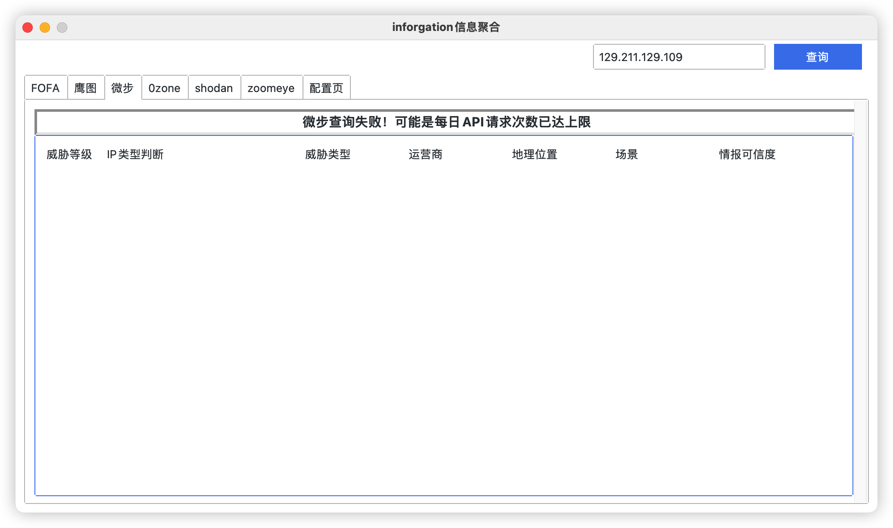
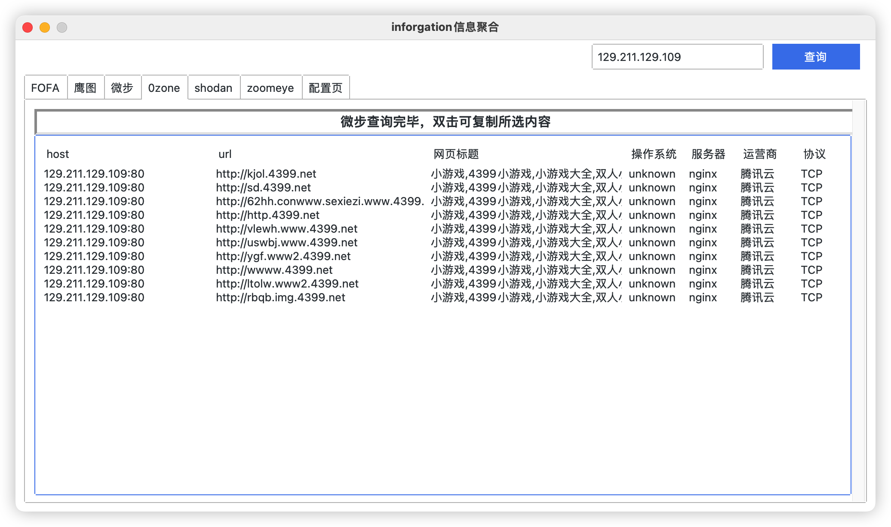
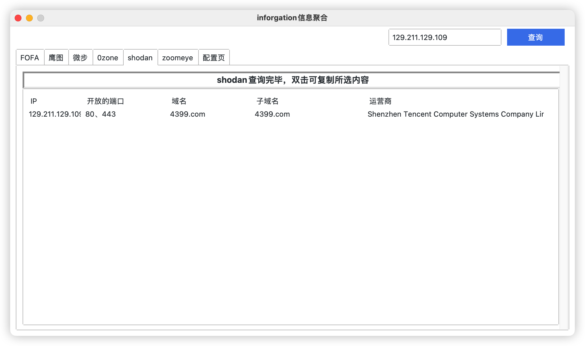
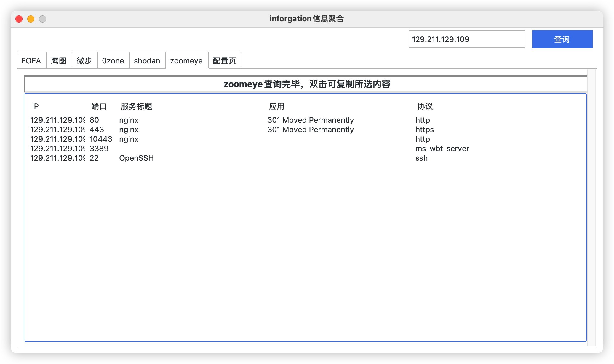

# inforGUI

python3+tkinter+ttk完成的项目

# 开始使用
## 目前0zone零零信安API暂不可用，结果页面暂时隐藏，计划更新为Quake API，近期上线

## 使用前请安装依赖：pip(3) install -r requirements.txt -i http://pypi.douban.com/simple/

### 1、首次使用会提示未发现config.ini，需要在配置页进行配置后才能进行正常查询，并将配置自动保存到当前目录的`config.ini`文件下

### 2、在config页配置各平台的apikey及其他信息

### 3、进行一次查询操作后会将配置文件保存到当前目录的config.ini

### 4、之后进行查询会自动读取config.ini的内容并放到配置页中，需要修改在配置页中进行修改即可，输入IP进行查询

# TODO

- [x] 多线程优化
- [x] 表格样式美化
- [ ] 总览页
- [ ] 域名页
- [ ] 关键信息综合页
- [ ] 其他平台接入
- [ ] and more......
