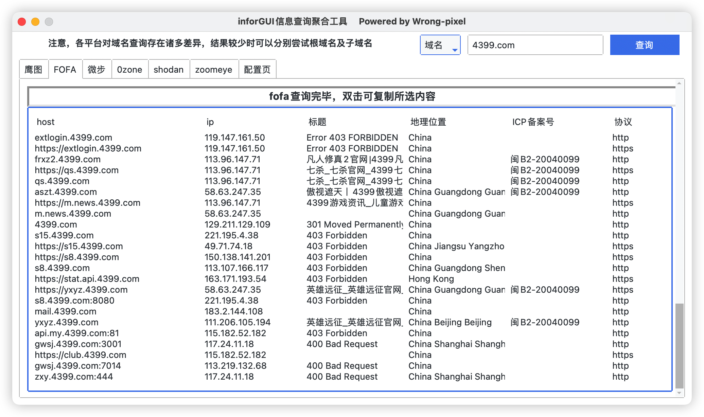

# inforGUI

python3+tkinter+ttk完成的项目

## 1.1版本更新域名查询，由于各家平台域名查询方式不同，根域名及子域名查询结果存在部分差异，等待后续版本更新

# 开始使用

## 使用前请安装依赖：pip(3) install -r requirements.txt -i http://pypi.douban.com/simple/

### 1、首次使用会提示未发现config.ini，需要在配置页进行配置后才能进行正常查询，并将配置自动保存到当前目录的`config.ini`文件下

### 2、在config页配置各平台的apikey及其他信息

### 3、进行一次查询操作后会将配置文件保存到当前目录的config.ini

### 4、之后进行查询会自动读取config.ini的内容并放到配置页中，需要修改在配置页中进行修改即可，选择查询方式（域名或者IP），输入目标进行查询

# TODO

- [x] 多线程优化
- [x] 表格样式美化
- [ ] 总览页
- [x] 域名页
- [ ] 关键信息综合页
- [ ] 其他平台接入
- [ ] and more......
